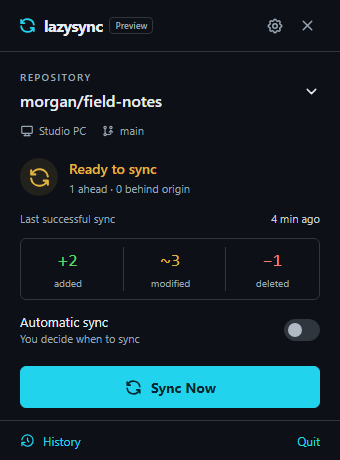

# lazysync

A compact Windows/macOS tray companion that syncs one selected GitHub checkout at a time. Svelte 5, TypeScript, Tailwind 4, Tauri 2, Rust, libgit2, and the native credential vault.



## Run

Install Node.js 22.12+ (24 recommended), Rust stable, and Git. Windows also requires Visual Studio C++ Build Tools and WebView2; macOS requires Xcode Command Line Tools. Follow [Tauri prerequisites](https://v2.tauri.app/start/prerequisites/).

```sh
npm ci
npm run tauri dev
```

`npm run dev` serves the frontend only. `http://127.0.0.1:1420/?preview` is an explicit development fixture; preview commands cannot modify real repositories. Production builds require the native bridge.

## Connect and sync

1. Open Settings and paste a GitHub personal access token. It is validated through `/user` and stored under service `lazysync`, account `github.com`, in Windows Credential Manager or macOS Keychain. Tokens never go into app settings, status events, URLs, or logs.
2. Click the repository selector. Accessible repositories are loaded in pages of 30; search filters loaded pages. Write access, owner, and privacy are displayed. Select a remembered checkout or choose Clone to folder / Connect existing checkout. Clone destinations must be empty. Existing origin must exactly match the selected GitHub HTTPS URL.
3. Alternatively, Create private repository creates under your personal account with `private: true`, `auto_init: false`. Non-Git folders start on `main`; existing history and remotes are preserved. Failed attachment is saved and can resume without repeating repository creation. Clearing saved setup never deletes the remote repository.
4. Confirm your device name and commit identity, then select Sync Now. Automatic sync starts Off; opt into After file changes (2-second debounce) or On folder idle (30 seconds) in Settings.

Classic PATs need `repo` scope for private repositories. Fine-grained PATs need selected-repository access, Contents read/write, and Metadata read; personal repository creation requires Administration read/write. Update the token's selected repositories after creation when necessary. Tokens can be replaced even during recovery. See the [GitHub repository API](https://docs.github.com/en/rest/repos/repos#create-a-repository-for-the-authenticated-user).

Only the active checkout is watched. Local status is checked every 10 seconds; real fetches happen every 60 seconds and during sync. Closing or blurring the flyout hides it; setup/recovery dialogs remain visible during native folder selection. Escape closes a dialog or hides the flyout. Quit exits. Changing branches externally pauses sync; Settings offers explicit branch reconfirmation, subject to upstream validation.

## Safe sync and recovery

The repository worker serializes operations. Sync validates checkout state, branch, upstream, identity, remote, and token access; writes a durable journal; preserves original HEAD under `refs/lazysync/backups/<operation>/original`; saves tracked/untracked changes in an app-marked stash; fetches; fast-forwards or rebases; applies the saved stash without dropping it; stages actual additions/modifications/deletions respecting ignores; commits; and pushes normally. Non-fast-forward rejection allows at most two refetch/rebase retries. Push acceptance is checked with a fetch before removing only the app-created stash. Recovery references are retained, including references before rebases. Empty syncs create no commit. Initial commits and empty remotes are supported.

Commits use `Sync from [DeviceName] - YYYY-MM-DD HH:mm`, with timezone offset and operation ID in the body. Local commits survive network/authentication failures. No force push, hard reset, forced checkout, stash pop, automatic user-file deletion, or deletion of user stashes is used.

App data lives in Tauri's platform configuration directory for `app.lazysync.desktop` (`%APPDATA%/app.lazysync.desktop` on Windows; `~/Library/Application Support/app.lazysync.desktop` on macOS). `config.json` and `recovery.json` are versioned and atomically replaced. Backup copies of original files and captured conflict blobs are in `recovery/<operation>/`. These contain your repository data, so keep that directory private.

Interrupted operations pause automation across restarts. Review Recovery shows labeled Local and Remote conflict-stage previews; full bytes are saved before resolution. Keep Local / Accept Remote support binary files and explicit deletions; Open in Editor uses the system text editor, followed by Mark editor changes resolved. Continue Sync is enabled after all files are resolved. More conflicts from later rebase commits may appear during continuation.

If a crash occurred inside an ambiguous local mutation, or an external file/index/HEAD edit is detected, lazysync fails closed instead of guessing. Inspect the journal, refs, and app-marked stash in a Git client. Preserve and reconcile your files and complete any Git operation before acknowledging **Finish Recovery**. This keeps all stashes/backups and turns automation off. You can then start a new manual sync. Do not delete `recovery.json` as a shortcut: it tracks saved work.

Git has no cross-process working-tree transaction. Fingerprint checks detect edits at operation boundaries and across network steps; avoid editing or running other Git clients during a sync. Recovery files and Git refs preserve the original work if an unexpected race occurs.

## Supported scope

GitHub.com over HTTPS, regular full checkouts, one active branch/upstream, personal private creation, PATs. Active hooks, attribute content filters (including LFS), submodules, configured mandatory signing, shallow clones, and linked/bare worktrees are blocked with actionable messages. Server rules that require signing may reject a push; local commits remain safe. History and diffs are read-only: 20 commits per page, 200 files per diff, 64 KiB text previews, and large/binary indicators. Initial files in an unborn checkout cannot be integrated with an already populated remote: clone the remote first and copy files over.

OAuth, organization-owned creation, advanced Git tooling, restoration from history, and automatic app updates are outside this release.

## Validate and package

```sh
npm run test:rust
npm run check
npm test
npm run build
npm run desktop:check
npm run test:ui
cargo clippy --manifest-path src-tauri/Cargo.toml --all-targets -- -D warnings
```

Rust tests use temporary checkouts and bare remotes; GitHub requests use a local mock HTTP server. They cover initial/clean sync, ignored/untracked/deleted files, divergence, saved stashes, text/binary/delete conflicts, concurrent pushes, branch/external changes, recovery boundaries, private creation, pagination, error redaction, and selection persistence. Playwright covers flyout controls and keyboard/modal behavior with development fixtures.

Windows: `npm run tauri build -- --bundles nsis,msi`. macOS: `npm run tauri build -- --bundles dmg`. Native bundles live in `src-tauri/target/release/bundle`. Icons are generated with Tauri tooling; the existing root `test.rs` is preserved.

Tag `v0.1.1` to run release CI. It verifies repository privacy, creates a draft release, builds Windows x64 `.exe`/`.msi` and Apple Silicon/Intel `.dmg`, attaches artifacts, and publishes only after every platform succeeds. The repository is never made public. See [Tauri distribution](https://v2.tauri.app/distribute/) and [Tauri GitHub Action](https://github.com/tauri-apps/tauri-action).

## Optional signing

For macOS, add GitHub Actions secrets `APPLE_CERTIFICATE` (base64 `.p12`), `APPLE_CERTIFICATE_PASSWORD`, `APPLE_SIGNING_IDENTITY`, `APPLE_ID`, `APPLE_PASSWORD` (app-specific), and `APPLE_TEAM_ID` for signing/notarization. Without them, builds are unsigned.

Windows Authenticode requires your certificate/provider. Add a secret-backed signing step or Tauri `bundle.windows.signCommand` override in a protected CI environment; keep certificate passwords outside source/configuration. See [Windows signing](https://v2.tauri.app/distribute/sign/windows/). This project does not invent a certificate or silently claim signed installers.
